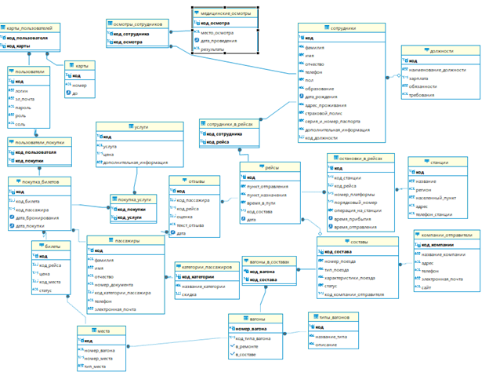
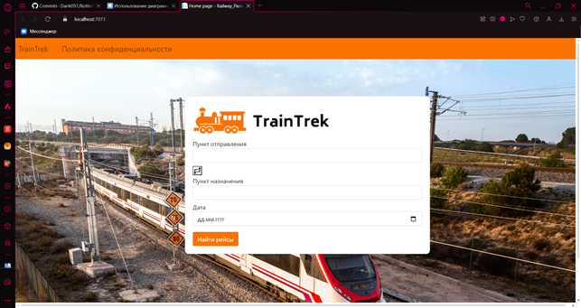
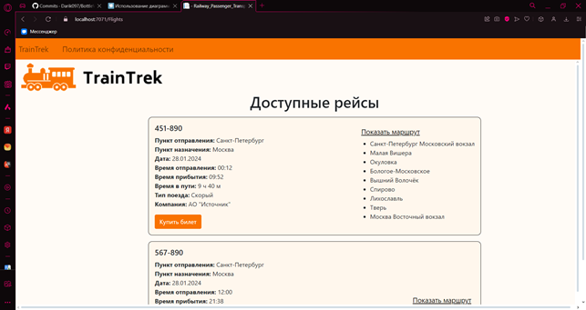
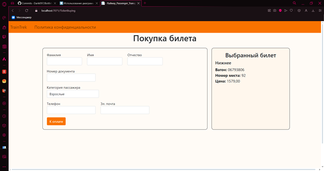
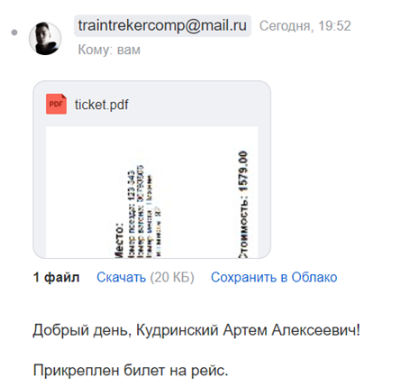
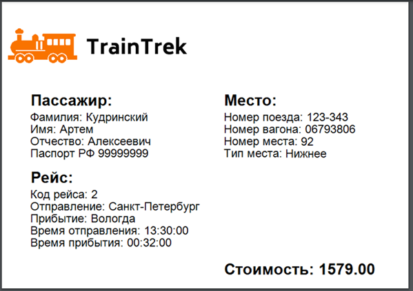

# RailwayPassengerTransportation


RailwayTicketSystem — это веб-приложение для покупки билетов на поезда дальнего следования, разработанное на платформе ASP.NET Core с использованием C# и PostgreSQL. Система предоставляет пользователям удобный интерфейс для поиска рейсов, выбора мест и оформления билетов с отправкой на электронную почту.

## Содержание

- [Описание](#описание)
- [Функциональные возможности](#функциональные-возможности)
- [Технологии](#технологии)
- [Архитектура системы](#архитектура-системы)
- [Настройка для разработки](#настройка-для-разработки)
- [Схема базы данных](#схема-базы-данных)
- [Безопасность](#безопасность)
- [Скриншоты](#скриншоты)
- [Контакты](#контакты)
- [Лицензия](#лицензия)

## Описание

RailwayPassengerTransportation — это комплексная информационная система для автоматизации процесса продажи железнодорожных билетов. Приложение позволяет пассажирам находить подходящие рейсы, выбирать места в вагонах, оформлять заказы и получать электронные билеты в формате PDF на указанную почту.

Система реализует ролевую модель доступа с тремя типами пользователей:
- **Гости** — просмотр рейсов, регистрация и авторизация
- **Пользователи** — полный доступ к покупке билетов, управление картами, просмотр истории
- **Администраторы** — полный доступ ко всем данным системы

## Функциональные возможности

- Просмотр расписания рейсов
- Поиск рейсов по направлениям и датам
- Регистрация и авторизация в системе
- Просмотр политики конфиденциальности

## Технологии

### Backend
- **Платформа:** ASP.NET Core
- **Язык программирования:** C#
- **База данных:** PostgreSQL 16
- **ORM:** Npgsql

### Frontend
- **HTML5** с Razor Pages
- **CSS3** с Bootstrap
- **JavaScript**

### Дополнительные библиотеки
- **iTextSharp** — генерация PDF-документов
- **System.Drawing** — создание графики для билетов
- **System.Net.Mail** — отправка email-уведомлений
- **Newtonsoft.Json** — работа с JSON
- **pgcrypto** — шифрование данных в БД

## Архитектура системы

### Модули приложения
- **Flights** — поиск и отображение рейсов
- **Tickets** — выбор и покупка билетов
- **Payment** — обработка платежей
- **TicketBuying** — ввод данных пассажира
- **SuccesfulPurchase** — подтверждение покупки

### База данных
Система использует реляционную базу данных PostgreSQL с 26 таблицами, включая:
- `рейсы` — информация о рейсах
- `билеты` — данные о билетах
- `пассажиры` — информация о пассажирах
- `пользователи` — учетные записи
- `карты` — зашифрованные данные платежных карт

## Настройка для разработки

### Предварительные требования
- .NET 6.0 SDK или выше
- PostgreSQL 16
- Visual Studio 2022

### Установка
1. Клонируйте репозиторий:
```sh
git clone https://github.com/your-username/RailwayTicketSystem.git
cd RailwayTicketSystem
```

2. Настройте базу данных:
   Создайте базу данных и выполните скрипты инициализации из папки Database/Scripts

3. Настройте подключение к БД в appsettings.json:
   ```json
   {
     "ConnectionStrings": {
      "DefaultConnection": "Host=localhost;Database=railway_tickets;Username=your_username;Password=your_password"
     }
   }
   ```

4. Запустите приложение
   ```sh
   dotnet run
   ```

## Схема базы данных


Система включает 26 взаимосвязанных таблиц с поддержкой внешних ключей, триггеров для автоматического обновления статусов, хранимых процедур, шифрования данных

## Безопасность

### Меры защиты
- Хеширование паролей с использованием pgcrypto.crypt()
- Шифрование номеров кредитных карт с помощью pgp_sym_encrypt()
- Ролевая модель доступа с разделением привилегий
- Защита от SQL-инъекций через параметризованные запросы
- Использование солей для хеширования

### Роли и права доступа
- Гости — только просмотр рейсов и регистрация
- Пользователи — покупка билетов, управление профилем
- Администраторы — полный доступ ко всем функциям

## Скриншоты










## Контакты

Если у вас есть вопросы или предложения, свяжитесь со мной:

- **Email:** dev.assist@yandex.ru
- **GitHub:** [CurvaRivazza](https://github.com/CurvaRivazza)

## Лицензия

Этот проект лицензирован под [MIT License](LICENSE)
